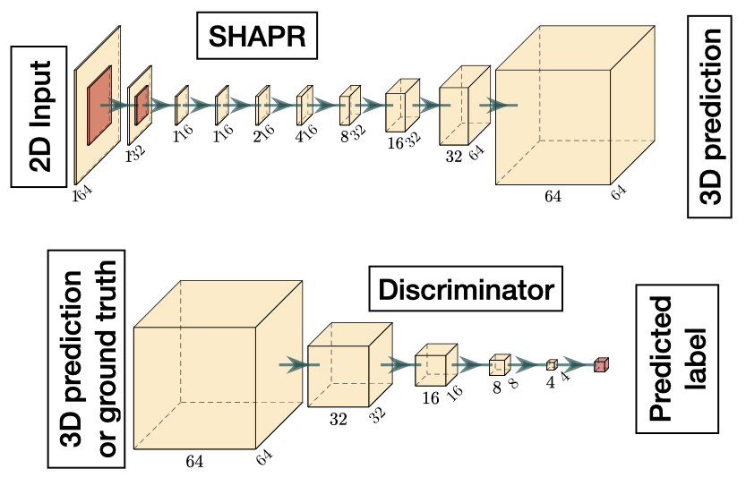
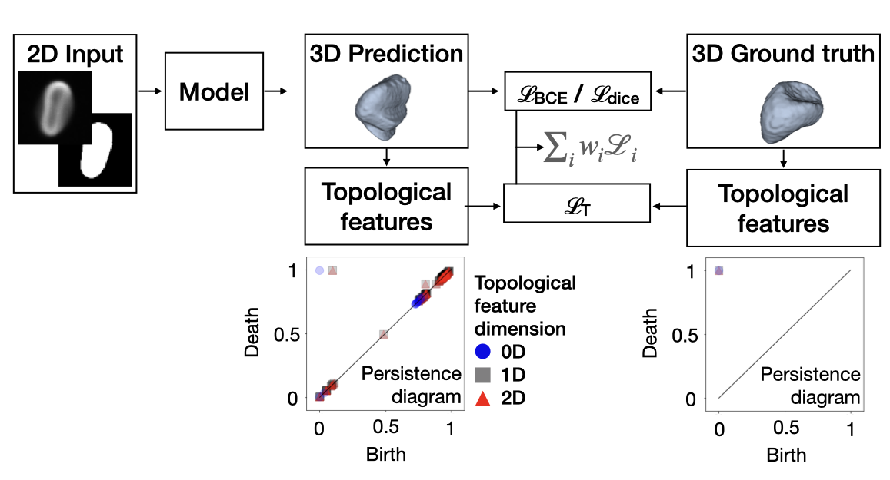

# SHAPR
<p align="center">

</p>

## Citation

If you use this code, please consider citing our paper:

```bibtex
@inproceedings{Waibel22a,
  author        = {Dominik J. E. Waibel and Scott Atwell and Matthias Meier and Carsten Marr and Bastian Rieck},
  title         = {Capturing Shape Information with Multi-Scale Topological Loss Terms for 3D Reconstruction},
  year          = {2022},
  booktitle     = {Medical Image Computing and Computer Assisted Intervention~(MICCAI)},
  archiveprefix = {arXiv},
  eprint        = {2203.01703},
  primaryclass  = {cs.CV},
  repository    = {https://github.com/marrlab/SHAPR_torch},
  pubstate      = {inpress},
}
```

## Introduction

Reconstructing the shapes of three dimensional (3D) objects from two
dimensional (2D) images is a task our brain constantly and unnoticeably
performs. Recently neural networks have been proposed to solve the same
task and trained to reconstruct the 3D shape of natural objects from 2D
photographs. An application to biomedical imaging, where the trade-off
between resolution and throughput is key, is missing so far.

Here, we show that deep learning can be used to predict the 3D shape of
single cells and single nuclei from 2D images and thereby reconstruct
relevant morphological information. Our SHAPR autoencoder is trained
with hundreds of 3D shapes and corresponding 2D sections of red blood
cells and differentiated induced pluripotent stem cells, and fine tuned
with an adversarial network inspired discriminator. We demonstrate the
power of our approach by showing that the 3D shapes of red blood cells
can be reconstructed more realistically than with simpler 3D models.
Moreover, the features extracted from the predicted 3D shapes lead to
a higher classification accuracy for six red blood cell types than the
features of the 2D image alone. Applied to human induced pluripotent
stem cells growing in a 3D culture, we demonstrate that SHAPR is able to
robustly reconstruct the shape of single nuclei from a 2D slice,
mimicking a single imaging step. Our work demonstrates that neural
networks can learn to reconstruct the 3D shape of single cells and
nuclei from 2D images. SHAPR is available as an easily installable, well
documented python package. Its application allows dramatically
increasing throughput for the characterization of cellular and
subcellular structures in biomedical imaging data.

For more information, please refer to our preprint on bioRxiv 
[here](https://www.biorxiv.org/content/10.1101/2021.09.29.462353v1).

<p align="center">

</p>

SHAPR consists of a 2D encoder, which embeds 2D images into a
latent space, and a 3D decoder, which reconstructs 3D shapes from the latent space representation.
To train SHAPR we segment 3D microscopy images (we show an exemplary single red blood cell).
We pair a 2D segmentation with the microscopy image of the same slice to enter the encoder as input.
During supervised training (Fig. 1, step 1), we minimize the reconstruction loss (see Methods),
which is the sum of the Dice loss and the binary cross entropy loss between the 3D segmentations and SHAPR predictions.
For an input image of 64 x 64 pixels, we provide the pixel sizes for
each layer in the gray boxes and the filter sizes on top of each box. In
the second step, we fine-tune SHAPR by adding a discriminator. The
discriminator is trained to differentiate between SHAPR output and
ground truth segmentation and minimize the adversarial loss. It thereby
challenges SHAPR to output realistic 3D objects.

<p align="center">

</p>

Given a predicted object and a 3D ground truth object, we calculate
topological features using (cubical) persistent homology, obtaining
a set of persistence diagrams. Each point in a persistence diagram
denotes the birth and death of a topological feature of some dimension of
the given object. We compare these diagrams using $\mathcal{L}_T$, our
topology-based loss, and weight this with existing loss terms like binary
cross entropy (BCE) and Dice.

## Installation

Fork the repository.

```console
$ cd SHAPR
$ pip3 install -e .
```

### Installation using a virtual environment

We would recommend to first set a virtual environment and then install the package:

```console
$ cd SHAPR
$ python3 -m venv .venv_shape
$ source .venv_shape/bin/activate
(.venv_shape) $ pip3 install -e .
```

By activating the virtual environment your shell’s prompt will be changed in order to show what virtual environment you’re using.

You can deactivate a virtual environment by:

```console
(.venv_shape) $ deactivate
```

We can also use the virtual environment as a kernel for Jupyter
Notebook. First you should install `ipykernel` package when the virtual
environment is **activated**:

```console
(.venv_shape) $ pip3 install ipykernel
```

We need to manually add our virtual environment as a kernel to Jupyter Notebook:

```console
(.venv_shape) $ python -m ipykernel install --name=.venv_shapr
```

Now by opening the Jupyter-Notebook you have the option to select the `.venv_shapr` as the kernel.

## Running SHAPR

Please find an example of how to run SHAPR from a jupyter notebook in
`SHAPR/docs/jupyter notebook/Run SHAPR from notebook.ipynb`.

You can also run SHAPR using a params.json file, which is provided in `SHAPR/docs/sample/params.json`.

### Setting parameters

To run SHAPR you should set the following parameters:
Setting parameters are:
- `path`: path to a folder that includes three subfolder of
    1. `obj`: containing the 3D groundtruth segmentations, 
    2. `mask`: containing the 2D masks, 
    3. `image`: containing the images from which the 2D masks were segmented (e.g. brightfield).
- `result_path`: path to a folder for saving the results of predictions.
- `pretrained_weights_path`: path to a folder for saving and reloading pretrain model 
- `random_seed`: seed for random generator in order to keep the results reproducible.

The setting parameters are read from the `settings` object. You may
change the setting parameters by directly changing their default values
in a `SHAPR/params.json` file or simply package API like:

```console
> from shapr import settings
> settings.path = "a/new/path"
```

We have added an example of a `params.json` file to `SHAPR/docs/sample/params.json`.
If you want to use it, please adapt the paths to your project and copy the `params.json` to `SHAPR/params.json`, then execute `SHAPR/shapr/run_train_script.py`.
You can also print all the parameters and their values using `print`:

```console
> print(settings)
------ settings parameters ------
path: "path value"
result_path: "result_path value"
pretrained_weights_path: "pretrained_weights_path value"
random_seed: 0
```

### Running specific parts of the training loop individually

You can run the training and evaluation on the test sample by calling
the `run_train()` and `run_evaluation()` functions, respectively.

```console
> from shapr import run_train
> run_train()
> run_evaluation()
```

### Folder structure 

SHAPR expects the data in the following folder structure (see sample).
With corresponding files having the same name. 2D microscopy images
(64x64px) should be contained in the images folder, 2D segmentations
(64x64px) in the mask folder and the 3D segmentation (64x64x64px) in the
obj folder. 

```
path
├── image                 
│   ├── 000003-num1.png
│   │── 000004-num9.png
│   │── 000006-num1.png
│   │── .
│   │── .
│   │── .
│   │── 059994-num1.png     
│
└── mask               
│   ├── 000003-num1.png
│   │── 000004-num9.png
│   │── 000006-num1.png
│   │── .
│   │── .
│   │── .
│   │── 059994-num1.png    
│
└── obj     
│   ├── 000003-num1.png
│   │── 000004-num9.png
│   │── 000006-num1.png
│   │── .
│   │── .
│   │── .
│   │── 059994-num1.png    
```

## Additional analyses

Next to the SHAPR model, we also provide additional scripts that permit
zooming into various aspects of SHAPR and persistent homology. All of
these scripts are to be found in the `scripts` subdirectory.

### Evaluation of results

To create the evaluation plots with all errors, as shown in the paper,
run the `evaluation.py` script:

```
$ python -m scripts.evaluation evaluation/red-blood-cell.json
```

You can optionally specify the `-q` option in order to skip evaluation
metrics that are computationally more complex to compute.

### Gallery of results

After running SHAPR, you can use the `make_gallery.py` script to create
a small gallery of all outputs. This is great for getting an overview of
how the model performed:

```shell
# Note that we are using a sample directory that contains ground truth
# objects. In a realistic scenario, you would rnu this command for the
# outputs of your own model.
$ python -m scripts.make_gallery ../docs/sample/obj 
```

### Interpolation errors

To run the analysis of the interpolation (i.e. downsampling) quality as
described in the supplementary materials, run the following command from
the `shapr` directory:

```shell
$ python -m scripts.analyse_interpolation -s 8 -p config/small-0D.json
```

This will generate the interpolation/downsampling errors for a volume of
side length `s = 8`.

### Persistent homology of images

To calculate persistent homology of input images, you can use the
following script:

```shell
$ python -m scripts.calculate_persistence_diagrams ../docs/sample/obj/*.tif
```

## Contributing

We are happy about any contributions. For any suggested changes, please
send a pull request to the `develop` branch.
