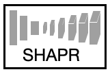
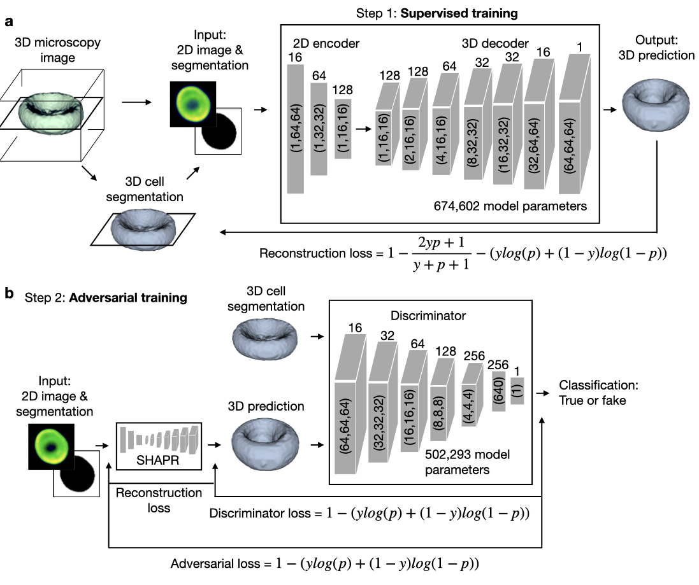

# SHAPR
<p align="center">

</p>
Reconstructing the shapes of three dimensional (3D) objects from two dimensional (2D) images is a task our brain constantly and unnoticeably performs. Recently neural networks have been proposed to solve the same task and trained to reconstruct the 3D shape of natural objects from 2D photographs. An application to biomedical imaging, where the tradeoff between resolution and throughput is key, is missing so far.
We here show that deep learning can be used to predict the 3D shape of single cells and single nuclei from 2D images and thereby reconstruct relevant morphological information. Our SHAPR autoencoder is trained with hundreds of 3D shapes and corresponding 2D sections of red blood cells and differentiated induced pluripotent stem cells, and fine tuned with an adversarial network inspired discriminator. We demonstrate the power of our approach by showing that the 3D shapes of red blood cells can be reconstructed more realistically than with simpler 3D models. Moreover, the features extracted from the predicted 3D shapes lead to a higher classification accuracy for six red blood cell types than the features of the 2D image alone. Applied to human induced pluripotent stem cells growing in a 3D culture, we demonstrate that SHAPR is able to robustly reconstruct the shape of single nuclei from a 2D slice, mimicking a single imaging step. Our work demonstrates that neural networks can learn to reconstruct the 3D shape of single cells and nuclei from 2D images.
SHAPR is available as an easily installable, well documented python package. Its application allows dramatically increasing throughput for the characterization of cellular and subcellular structures in biomedical imaging data.

please refer to our preprint on bioRxiv 
[here](https://www.biorxiv.org/content/10.1101/2021.09.29.462353v1)


<p align="center">

</p>
a, SHAPR consists of a 2D encoder, which embeds 2D images into a 128-dimensional latent space, and a 3D decoder, which reconstructs 3D shapes from the latent space representation. To train SHAPR we segment 3D microscopy images (we show an exemplary single red blood cell). We pair a 2D segmentation with the microscopy image of the same slice to enter the encoder as input. During supervised training (Fig. 1, step 1), we minimize the reconstruction loss (see Methods), which is the sum of the Dice loss and the binary cross entropy loss between the 3D segmentations y and SHAPR predictions p. For an input image of 64 x 64 pixels, we provide the pixel sizes for each layer in the gray boxes and the filter sizes on top of each box. b, In the second step, we fine-tune SHAPR by adding a discriminator. The discriminator is trained to differentiate between SHAPR output p ground truth segmentation r and minimize the adversarial loss. It thereby challenges SHAPR to output realistic 3D objects.


## Installation:

Fork the repository.

```console
$ cd SHAPR
$ pip3 install -e .
```

### Installation using a vitual environment:
We would recommend to first set a virtual environment and then install the package:

```console
$ cd SHAPR
$ python3 -m venv .venv_shape
$ source .venv_shape/bin/activate
(.venv_shape) $ pip3 install -e .
```
By activating the virtual environment your shell’s prompt will be changed in order to show what virtual environment you’re using.

You can dectivate a virtual environment by:
```console
(.venv_shape) $ deactivate
```

We can also use the virtual environment as a kernel for Jupyter Notebook. First you should install `ipykernel' package when the virtual environment is **activated**:

```console
(.venv_shape) $ pip3 install ipykernel
```

We need to manually add our virtual environment as a kernel to Jupyter Notebook:

```console
(.venv_shape) $ python -m ipykernel install --name=.venv_shapr
```

Now by openning the Jupyter-Notebook you have the option to select the `.venv_shapr` as the kernel.

## Installation using pip install:
You can also install SHAPR using:
```console
pip install shapr
```

For running the code, you need to have Python 3.6 or higher installed. In addition, these are the main dependencies:

```yaml
- cudatoolkit: 10.1.243 # in case of GPU existance
- cudnn: 7.6.5 # in case of GPU existance
- h5py: 2.10.0
- hdf5: 1.10.6
- imageio: 2.9.0
- keras: 2.4.3
- matplotlib: 3.3.4
- numpy: 1.20.3
- python: 3.6.7
- scikit-image: 0.18.1
- scikit-learn: 0.24.1
- scipy: 1.6.2
- tensorflow: 2.4.1
- tensorflow-gpu: 2.4.1 # in case of GPU existance
```


## Running SHAPR:

Please find an example of how to run SHAPR from a jupyter notebook in  /SHAPR/docs/jupyter notebook/Run SHAPR from notebook.ipynb

You can also run SHAPR using a params.json file, which is provided in SHAPR/docs/sample/params.json.

# Setting parameters
To run SHAPR you should set the following parameters:
Setting parameters are:
- `path`: path to a folder that includes three subfolder of
    1. `obj`: containing the 3D groundtruth segmentations, 
    2. `mask`: containing the 2D masks, 
    3. `image`: containing the images from which the 2D masks were segmented (e.g. brightfield).
- `result_path`: path to a folder for saving the results of predictions.
- `pretrained_weights_path`: path to a folder for saving and reloading pretrain model 
- `random_seed`: seed for random generator in order to keep the results reproducible.

The setting parameters are read from the `settings` object. You may change the setting parameters by directly changing their default values in a '/SHAPR/params.json` file or simply package API like:
```console
> from shapr import settings
> settings.path = "a/new/path"
```
We have added an example of a 'params.json' file to SHAPR/docs/sample/params.json. If you want to use it, please adapt the paths to your project and copy the 'params.json' to /SHAPR/params.json, then execute the /SHAPR/shapr/run_train_script.py
You can also print all the parameters and their values using `print()` function:

> print(settings)
------ settings parameters ------
path: "path value"
result_path: "result_path value"
pretrained_weights_path: "pretrained_weights_path value"
random_seed: 0
```

## Running functions:
You can run the training and evaluating on the test sample by calling the `run_train()` and `run_evaluation()` functions respectively.
```console
> from shapr import run_train
> run_train()
> run_evaluation()
```

## Folder structure 
SHAPR expects the data in the following folder structure (see sample). With corresponding files having the same name. 2D microscopy images (64x64px) should be contained in the images folder, 2D segmentations (64x64px) in the mask folder and the 3D segmentation (64x64x64px) in the obj folder. 
```bash
path
├── image                 
│   ├── 000003-num1.png
│   │── 000004-num9.png
│   │── 000006-num1.png
│   │── .
│   │── .
│   │── .
│   │── 059994-num1.png     
│
└── mask               
│   ├── 000003-num1.png
│   │── 000004-num9.png
│   │── 000006-num1.png
│   │── .
│   │── .
│   │── .
│   │── 059994-num1.png    
│
└── obj     
│   ├── 000003-num1.png
│   │── 000004-num9.png
│   │── 000006-num1.png
│   │── .
│   │── .
│   │── .
│   │── 059994-num1.png    

```


## Contributing

We are happy about any contributions. For any suggested changes, please send a pull request to the *develop* branch.

## Citation

If you use SHAPR, please cite this paper: https://www.biorxiv.org/content/10.1101/2021.09.29.462353v1

